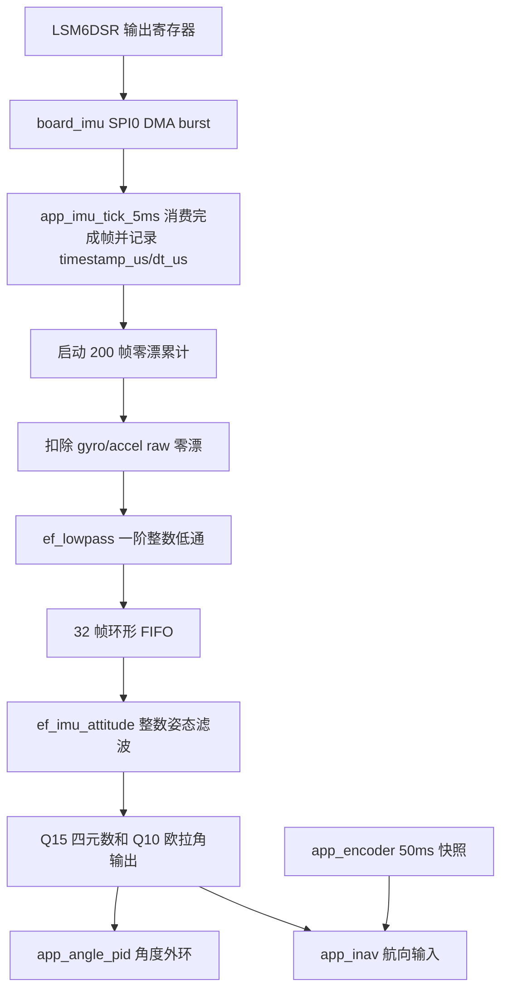
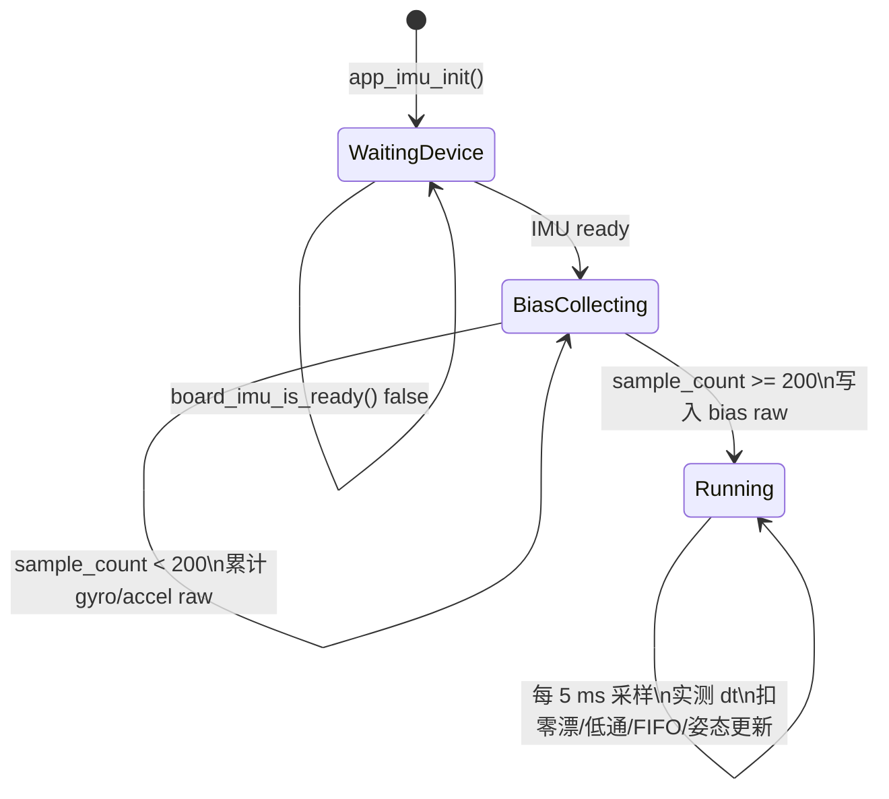

# IMU 数据处理接入计划

本文记录 LSM6DSR 到姿态输出的当前实现和后续接入路径。当前阶段完成 SPI0 DMA burst 采样、实测 `dt`、启动零漂、环形 FIFO、低通预处理和 M0+ 整数姿态滤波。

## 需求拆解

| 需求 | 当前状态 | 代码入口 |
| --- | --- | --- |
| LSM6DSR 合适初始化寄存器 | 已完成，208 Hz、±4 g、±1000 dps、BDU、IF_INC、关 I2C/I3C、开 gyro LPF1 | `lsm6dsr_init()` |
| 5 ms IMU 采样 | 已完成，App 周期任务触发 | `app_imu_tick_5ms()` |
| `dt` 定时器实测 | 已完成，由 `main()` 注入 `ef_time_micros()`，每帧记录 `dt_us` | `ef_time`、`app_imu` |
| 环形 FIFO 缓冲 | 已完成，32 帧，满时覆盖最旧样本 | `app_imu_fifo_pop()` |
| 启动零漂 | 已完成基础累计，启动后 200 帧求 gyro/accel raw 平均 | `app_imu_get_bias()` |
| 低通滤波 | 已完成 raw 预处理和 Q10 输出低通 | `ef_lowpass`、`ef_imu_attitude` |
| 四元数 Q15 | 已完成 gyro 四元数积分、accel 互补校正和整数归一化 | `ef_imu_attitude` |
| 欧拉角 Q10 | 已完成 gyro 积分、accel roll/pitch 互补校正和 Q10 输出 | `app_imu_get_attitude()` |
| 角度外环 | 已完成 App 层 roll/pitch/yaw PID 框架，默认关闭，输出通过回调交给上层控制 | `app_angle_pid_tick_10ms()` |
| 惯导接口 | 已完成 IMU yaw + 编码器 step 的 step Q10 惯导框架，并保留外部里程计注入接口 | `app_inav_tick_50ms()` |
| DMA SPI | 已完成 SPI0/SPI1 DMA 全双工异步传输；IMU 使用 SPI0 burst 读取 | `ef_spi_transfer_async()`、`board_imu_start_read_async()` |
| 屏幕刷新 10 Hz | 已完成，LCD 任务周期 100 ms | `app.c` |

## 定点格式

| 数据 | 格式 | 说明 |
| --- | --- | --- |
| 内部四元数 | Q15 | `1.0` 使用 `32767` 表示，避免 M0+ 无 FPU 下使用浮点 |
| 输出欧拉角 | Q10 | 单位为度，`1 deg = 1024` |
| 控制器输入 | Q10 / Q12 | 控制模块按带宽和动态范围选择 |
| `dt` | us 整数 | 使用定时器实测值，不假设固定 5 ms |

## 数据路径

## IMU 状态机

## 周期和缓冲

| 项目 | 数值 | 说明 |
| --- | ---: | --- |
| App IMU 任务 | 5 ms | 对应 200 Hz 前台采样，匹配 LSM6DSR 208 Hz ODR |
| LSM6DSR ODR | 208 Hz | 比 5 ms 调度略高，降低重复读取概率 |
| FIFO 容量 | 32 帧 | 约 160 ms 缓冲；满时覆盖最旧帧 |
| 零漂样本数 | 200 帧 | 约 1 s 启动静止采样 |
| LCD 刷新 | 100 ms | 10 Hz，避免显示占用高频采样时间 |

## DMA SPI 数据路径

当前 `Drivers/ef_spi` 已支持 SPI0/SPI1 DMA 全双工异步传输，`BoardDevices/board_imu` 负责 IMU 片选、TX/RX DMA 缓冲和结果解码：

1. `ef_spi_transfer_async(EF_SPI_SENSOR, ...)` 使用 SPI0 TX/RX DMA 完成 burst 传输。
2. `board_imu_start_read_async()` 发送 `OUT_TEMP_L` 读命令和 14 个 dummy byte，读取温度、gyro XYZ、accel XYZ。
3. DMA 回调释放 IMU CS，并将结果标记为可消费。
4. `board_imu_read_async_result()` 用 `lsm6dsr_decode_raw_sample()` 解码寄存器字节并换算工程单位。
5. `app_imu_tick_5ms()` 只负责消费完成帧、测 `dt`、处理 FIFO/滤波/姿态；不直接碰 DMA、SPI 寄存器或片选。
6. 如果使用 IMU data-ready 中断，也应先进 BoardDevices 转成采样就绪状态；App 仍按调度器消费，不直接绑定裸 NVIC/GPIO。

## 姿态解算状态

`Components/ef_imu_attitude` 当前保持纯算法边界：

1. 用 gyro raw 零漂修正后的角速度和实测 `dt_us` 积分 roll/pitch/yaw 目标角。
2. 用 accel 方向做 roll/pitch 倾角校正，互补滤波权重使用整数 shift 参数表达。
3. 对输出欧拉角 Q10 做低通，`1 deg = 1024`。
4. 姿态内部保持 Q15 四元数，`1.0 = 32767`，每次更新后做整数归一化。
5. 控制环只读取 `app_imu_attitude_t` 快照，不访问 FIFO 内部结构。

注意：当前 accel 零漂只作为启动状态记录，姿态解算使用未扣重力的工程单位加速度，避免把重力当成传感器偏置全部扣掉。整数 atan2/sqrt 的角度精度后续仍可增强，但仍应保持在 Components 层。

## 角度环和惯导接口

- `app_angle_pid` 读取 `app_imu_get_attitude()`，输入为度 Q10，PID 增益为 Q8，输出为 App 层控制量；默认不使能，业务层显式设置目标角和输出回调后才会产生非零输出。
- `app_inav` 读取 `app_imu_get_attitude()` 的 yaw 和 `app_encoder_get_snapshot()` 的左右 step 增量，积分得到 step Q10 位置、距离和速度快照。
- `app_inav_set_odom_reader()` 和 `app_inav_push_odom_delta()` 是预留里程计接口，后续可接轮式里程计、光流或视觉里程计，不需要改 IMU 采样或编码器底层。
- 角度环和惯导都不包含 `ef_spi`、`ef_gpio`、TI DriverLib、裸引脚宏或芯片寄存器头；底层资源仍由 BoardDevices/Drivers 隐藏。
