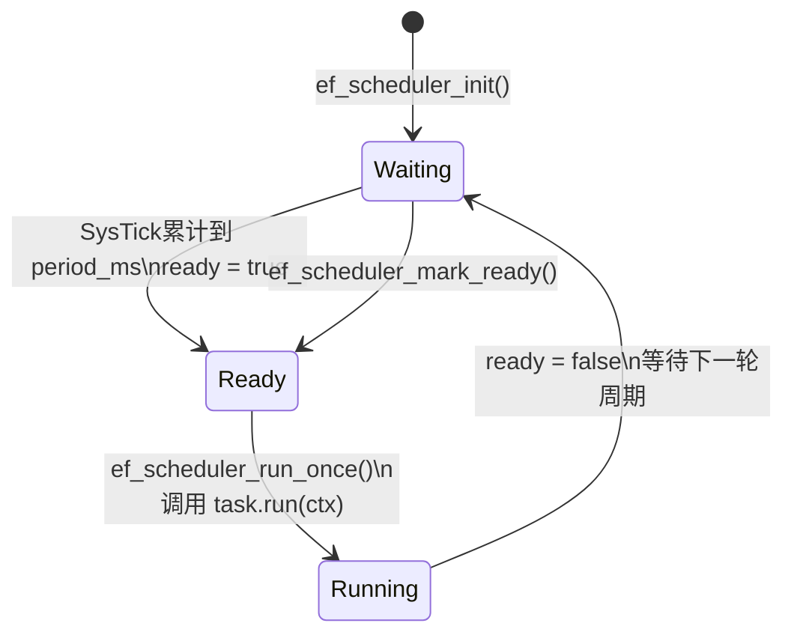
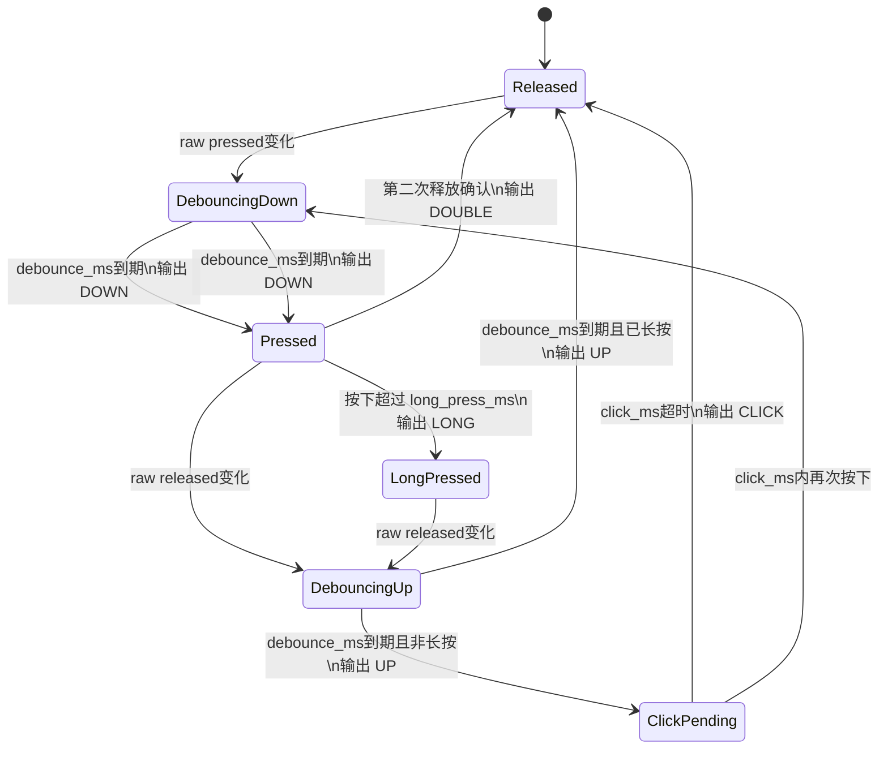
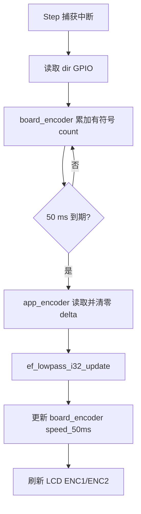
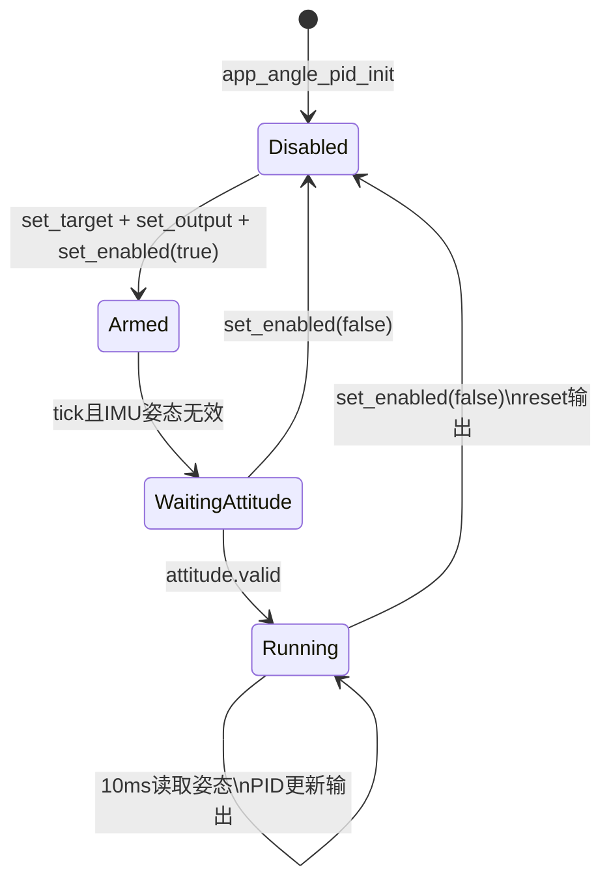
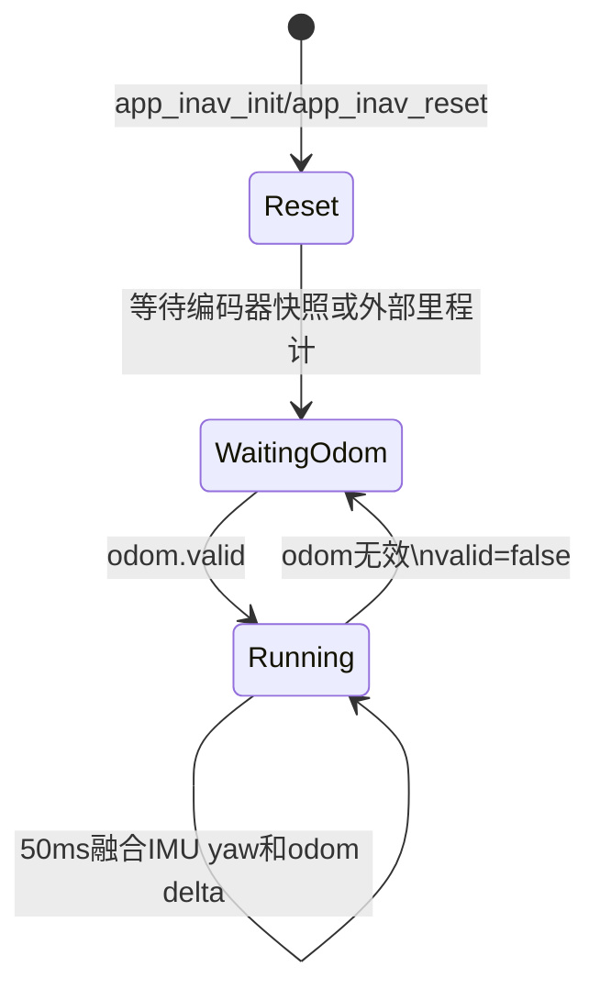
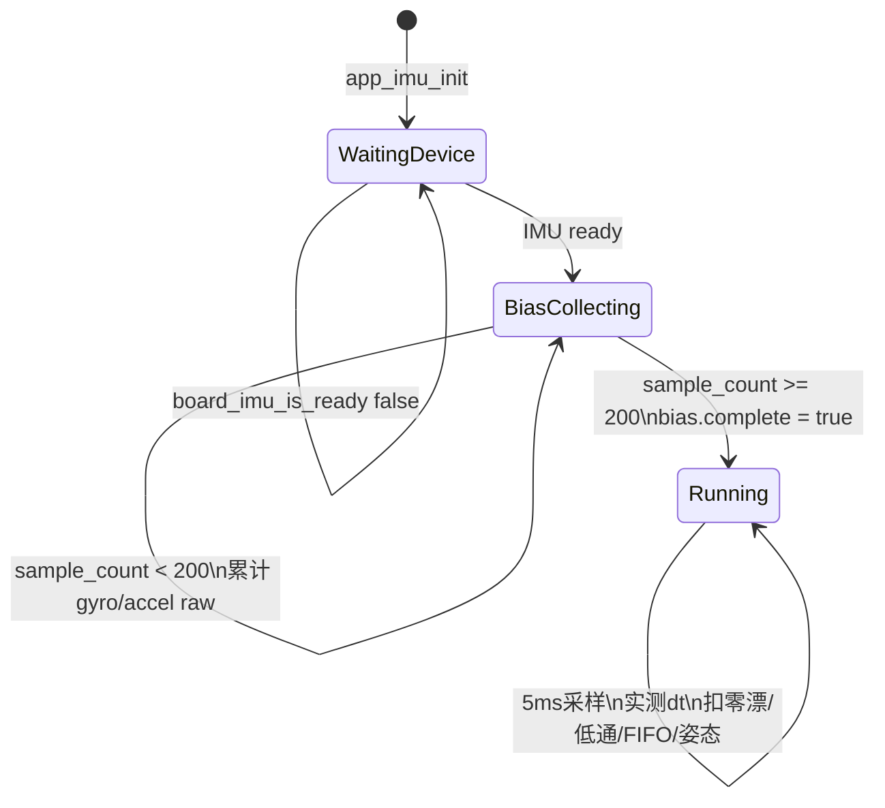

# 调度与状态机

本文档把当前固件里的“轮询”拆开说明：它不是无结构地反复读外设，而是由 1 ms 系统节拍驱动的前台调度状态机，再由各模块维护自己的局部状态机。

## 前台调度器状态机

`ef_scheduler` 对每个任务维护两个核心状态量：

- `elapsed_ms`：距离上次触发已经累计的毫秒数。
- `ready`：任务是否已到期，等待前台执行。



中断里只做计数和置位，不直接跑业务；业务都在 `app_run_forever()` 进入的前台循环里执行。

## 调度循环

```mermaid
flowchart TD
    A[main] --> B[ef_platform_init]
    B --> C[ef_log_set_time_fn]
    C --> D[app_start]
    D --> E[ef_scheduler_init]
    E --> F[app_run_forever]
    F --> G[ef_scheduler_run_once]
    G --> H{有 ready 任务?}
    H -- 是 --> I[调用任务 run(ctx)]
    I --> G
    H -- 否 --> J[ef_platform_idle]
    J --> G
```

## App 周期任务

| 任务 | 周期 | 状态机/状态量 | 主要输出 |
| --- | ---: | --- | --- |
| `app_button_task` | 10 ms | `ef_button_t` | 按键事件和状态行 |
| `app_lcd_task` | 100 ms | `g_heartbeat_on`、LCD 脏矩形队列 | 屏幕局部刷新 |
| `app_imu_task` | 5 ms | 零漂状态、低通状态、32 帧 FIFO、姿态快照 | IMU 样本流和 Q15/Q10 姿态输出缓存 |
| `app_angle_pid_task` | 10 ms | 单轴 PID、目标角、输出回调 | roll/pitch/yaw 角度环控制量 |
| `app_encoder_task` | 50 ms | `ef_lowpass_i32_t`、`board_encoder` 计数器、编码器快照 | 两路速度值和里程计增量 |
| `app_inav_task` | 50 ms | step Q10 位置、IMU 航向、里程计有效标志 | 惯导状态快照 |
| `app_motor_task` | 50 ms | 速度环 PID、目标速度、输出回调 | 电机速度环控制量 |
| `app_led_task` | 500 ms | `ef_event` 事件绑定 | LED 翻转事件 |

## 按钮状态机

`ef_button` 是显式状态机，输入是 10 ms 轮询到的原始按下状态，输出是离散事件。



代码实现没有单独保存 `DebouncingDown/DebouncingUp` 枚举，而是用 `last_raw_pressed`、`stable_pressed` 和 `raw_changed_ms` 表达消抖中间态；`click_pending` 表达等待单击/双击判定的状态。

## 编码器速度状态机

编码器 step 由定时器输入捕获中断累加，App 只在 50 ms 周期读取并清零累计值。速度显示状态由低通滤波器保持。



`ef_lowpass_i32_t` 的状态只有当前输出值 `value`、滤波强度 `shift` 和零点阈值 `zero_threshold`。当前 `shift=1`，即每次采样引入一半新值，50 ms 采样下响应量级约 100 ms。

## 角度环状态机

`app_angle_pid` 是 App 层角度外环。默认初始化后处于关闭状态，业务层需要设置目标角、输出回调并使能单轴。



角度环只读取 `app_imu_get_attitude()`，输出通过 `app_angle_pid_output_fn_t` 回调交给上层控制，不直接绑定 PWM、GPIO 或板级电机资源。

## 惯导融合状态机

`app_inav` 当前是 IMU + 编码器融合框架，默认里程计源为 `app_encoder_get_snapshot()`；后续外部里程计可以通过注入接口替换或补充。



| 数据 | 来源 | 保存位置 | 说明 |
| --- | --- | --- | --- |
| 航向 | `app_imu_get_attitude().yaw_deg_q10` | `g_inav_state.heading_deg_q10` | IMU 有效时优先使用 IMU yaw |
| 默认里程计 | `app_encoder_get_snapshot()` | `app_inav_odom_delta_t` | 左右 step 增量合成 forward step Q10 |
| 外部里程计 | `app_inav_set_odom_reader()` / `app_inav_push_odom_delta()` | `g_odom_reader` / `g_pending_odom` | 保留给轮式里程计、光流或视觉里程计 |
| 位置 | 惯导积分 | `g_inav_state.x/y_steps_q10` | 单位保持 step Q10，不在 App 层硬编码米制标定 |

## 状态页刷新状态机

LCD 状态页使用文本缓存和脏矩形刷新：

1. 各模块调用 `app_status_page_set_line()` 写入对应行的文本缓存。
2. 状态页只重绘被更新的文字区域。
3. `app_lcd_task` 每 100 ms 翻转心跳块，并调用 `board_lcd_service()` 推送脏矩形。

这种方式避免每个业务模块直接控制 LCD 坐标，也避免每次状态变化都阻塞等待整屏刷新。

## IMU 采样状态机

`app_imu` 以 5 ms 前台任务消费 LSM6DSR DMA 采样结果。当前阶段完成 SPI0 DMA burst 读取、实测 `dt`、启动零漂、低通预处理、App 环形 FIFO、Q15 四元数和 Q10 欧拉角输出。



| 状态/数据 | 保存位置 | 更新条件 |
| --- | --- | --- |
| 设备就绪 | `g_imu_sampling_ready` | `board_imu_is_ready()` 或自动初始化成功 |
| 零漂累计 | `g_gyro_bias_accum[]`、`g_accel_bias_accum[]` | 每帧采样直到 200 帧 |
| 零漂结果 | `g_imu_bias` | 200 帧完成后锁定 |
| 低通状态 | `g_accel_filters[]`、`g_gyro_filters[]` | 每 5 ms 样本更新 |
| FIFO | `g_imu_fifo[]`、`head/tail/count` | 每 5 ms push，消费方 pop |
| 姿态滤波 | `g_attitude_filter` | 零漂完成且 `dt_us != 0` 后更新 Q15/Q10 姿态 |
| 姿态快照 | `g_imu_attitude` | `ef_imu_attitude_update()` 成功后更新，供控制/显示读取 |
